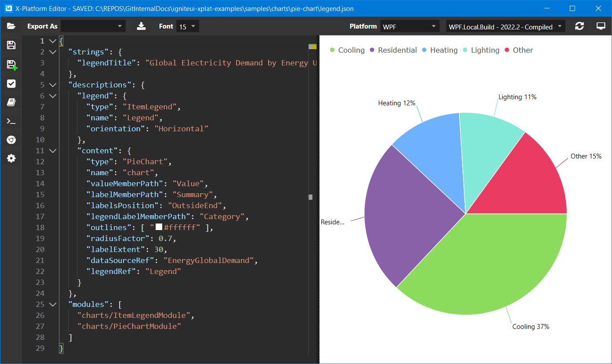
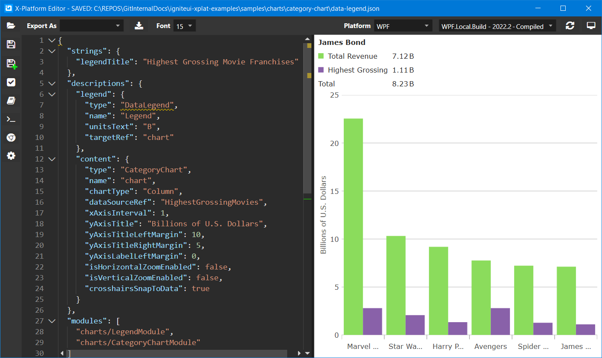
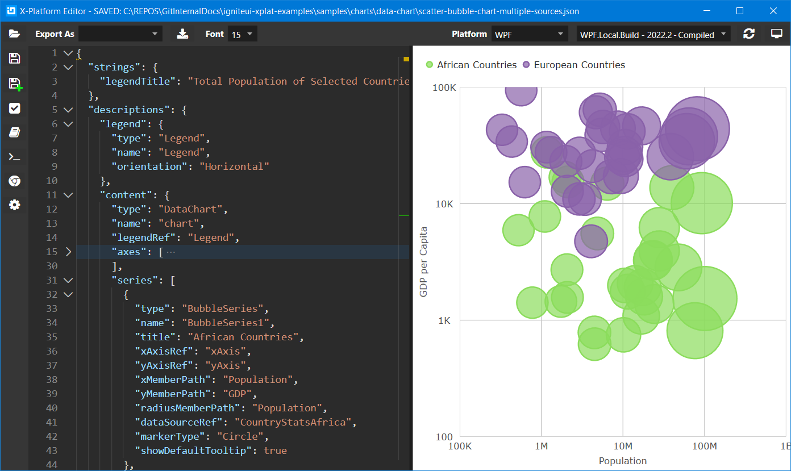
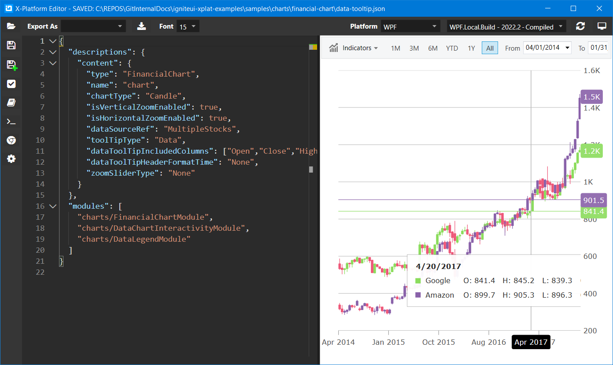
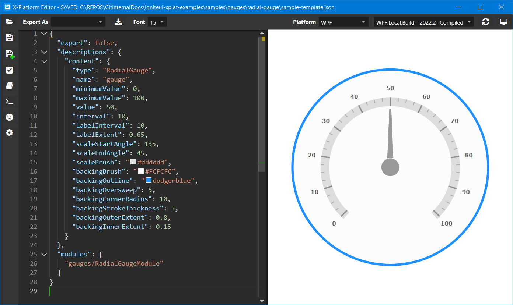

    

# Cross Platform Examples for Ignite UI Components

This repository provides source code for:
- [cross-platform samples](./samples) of Ignite UI components for Angular, Blazor, React, WebComponents, and WPF platforms. Currently, we support the following components: [Category Chart](./samples/charts/category-chart), [Data Chart](./samples/charts/data-chart), [Financial Chart](./samples/charts/financial-chart), [Pie Chart](./samples/charts/pie-chart), [Radial Gauge](./samples/gauges/radial-gauge), [Data Grid](./samples/grids/grid), [Hierarchical Grid](./samples/grids/hierarchical-grid), [Pivot Grid](./samples/grids/pivot-grid), [Tree Grid](./samples/grids/tree-grid)
- [code-gen-library](./code-gen-library) with data sources and event handlers used in [cross-platform samples](./samples)
- [editor-templates](./editor-templates) are platform specific applications used for exporting [cross-platform samples](./samples)

    <!-- 
Examples
 -->
    <!--  -->
    <!-- 
for Web Components 
 -->

## Cross Platform Editor

You can use the [Cross Platform Editor](https://infragistics.visualstudio.com/NetAdvantage/_git/ig-editor-desktop) WPF application to render and export cross-platform examples to Angular, Blazor, React, WebComponents, and WPF platforms.

## Pie Chart Example

## Category Chart Example

## Data Chart Example

## Financial Chart Example

## Radial Gauge Example

