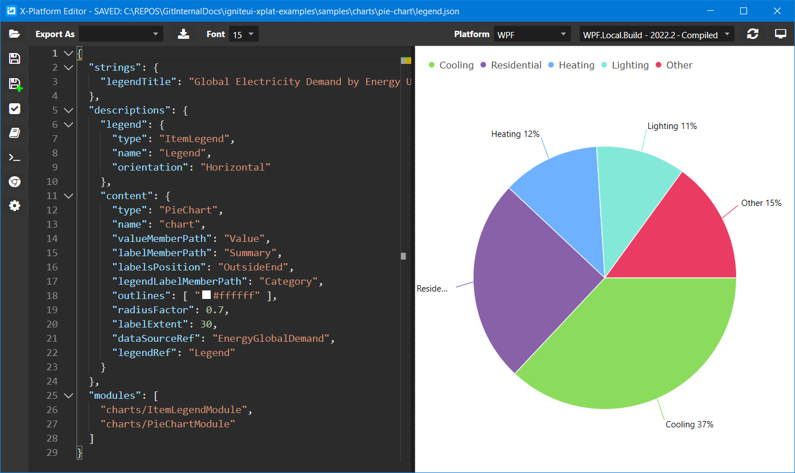
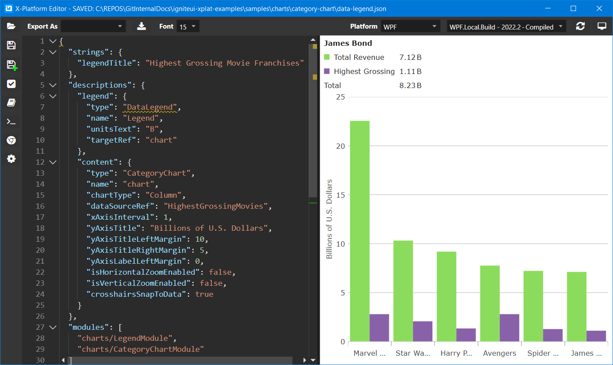
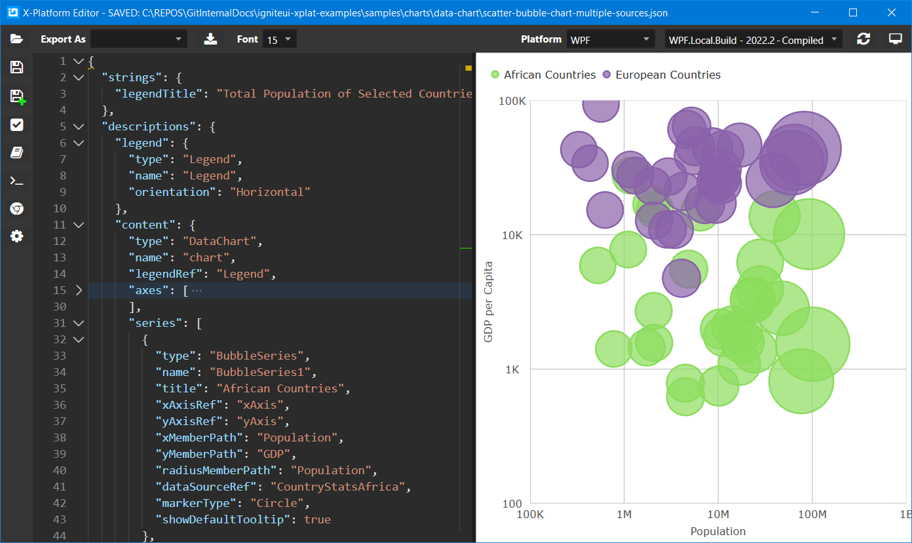
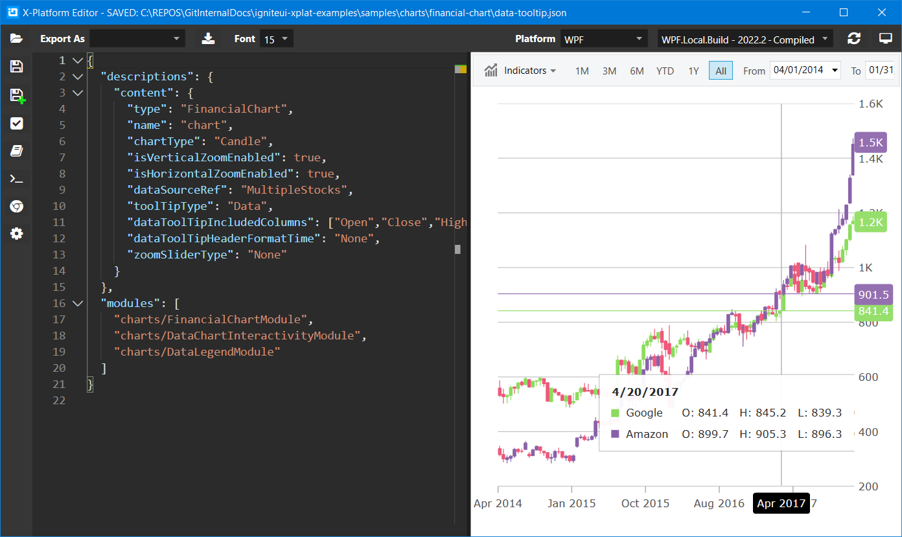
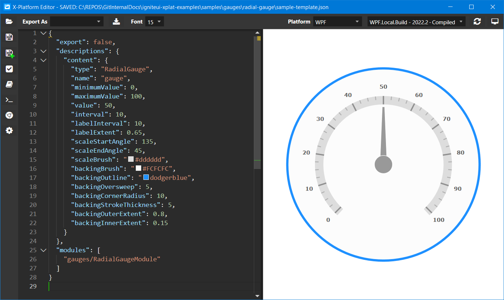

    

# Cross-Platform Examples for Ignite UI Componentss

This repository provides source code for:
- [cross-platform samples](./samples) of Ignite UI components for Angular, Blazor, React, WebComponents, and WPF platforms. Currently, we support the following components: [Category Chart](./samples/charts/category-chart), [Data Chart](./samples/charts/data-chart), [Financial Chart](./samples/charts/financial-chart), [Pie Chart](./samples/charts/pie-chart), [Radial Gauge](./samples/gauges/radial-gauge), [Data Grid](./samples/grids/grid), [Hierarchical Grid](./samples/grids/hierarchical-grid), [Pivot Grid](./samples/grids/pivot-grid), [Tree Grid](./samples/grids/tree-grid)
- [code-gen-library](./code-gen-library) with data sources and event handlers used in [cross-platform samples](./samples)
- [editor-templates](./editor-templates) are platform specific applications used for exporting [cross-platform samples](./samples)

    <!-- 
Examples
 -->
    <!--  -->
    <!-- 
for Web Components 
 -->

## Table of Contents

- [Using Cross-Platform Editor](#Using-Cross-Platform-Editor)
- [Updating Editor Templates](#Updating-Editor-Templates)

## Using Cross-Platform Editor

You can use the [Cross Platform Editor](https://infragistics.visualstudio.com/NetAdvantage/_git/ig-editor-desktop) WPF application to render and export cross-platform examples to Angular, Blazor, React, WebComponents, and WPF platforms.

### Pie Chart Example

### Category Chart Example

### Data Chart Example

### Financial Chart Example

### Radial Gauge Example

## Updating Editor Templates

The [Editor-Templates](editor-templates) folder contains templates for converting XPLAT samples into platform specifc samples. You **must update** those templates in the following order:

1. Create AND merge a pull request with updated packages in `browser` AND `samples` folders of the following repositories:
- [igniteui-angular-examples](https://github.com/IgniteUI/igniteui-angular-examples)
- [igniteui-blazor-examples](https://github.com/IgniteUI/igniteui-blazor-examples)
- [igniteui-react-examples](https://github.com/IgniteUI/igniteui-react-examples)
- [igniteui-wc-examples](https://github.com/IgniteUI/igniteui-wc-examples)

2. Create AND merge a pull request with updated packages in the [Editor-Templates](editor-templates) folder in this repository.

Above order of creating and merging pull requests is important to avoid stale samples and prevent building issues in platform specifc sample browsers.

## Creating Volume Branch in Code Exporter App Repo

- create **new volume branch** (e.g. 2025.1) in [code exporter app](https://infragistics.visualstudio.com/NetAdvantage/_git/code-exporter-app) repo

- update the included branches in [build-pipeline.yml](https://infragistics.visualstudio.com/NetAdvantage/_git/code-exporter-app?path=/azure-pipelines/build-pipeline.yml)

- move the old volume branch (e.g. 24.2) to excluded branches in [build-pipeline.yml](https://infragistics.visualstudio.com/NetAdvantage/_git/code-exporter-app?path=/azure-pipelines/build-pipeline.yml)

- update the definition ID for WPF product in [build-pipeline.yml](https://infragistics.visualstudio.com/NetAdvantage/_git/code-exporter-app?path=/azure-pipelines/build-pipeline.yml&version=GB2024.2&line=46&lineEnd=47&lineStartColumn=1&lineEndColumn=1&lineStyle=plain&_a=contents)

- publish the new branch

- wait for a successful build of code-exporter-app on this [website](https://infragistics.visualstudio.com/NetAdvantage/_build?definitionId=261)

## Creating Volume Branch in XPLAT-examples Repo

- complete steps in previous section

- create **new volume branch** (e.g. 25.1) in [xplat-examples](https://github.com/IgniteUI/igniteui-xplat-examples) repo

- update the included branches in [build-pipeline.yml](https://github.com/IgniteUI/igniteui-xplat-examples/blob/24.2.x/azure-pipelines/build-pipeline.yml)

- move the old volume branch (e.g. 24.2) to excluded branches in [build-pipeline.yml](https://github.com/IgniteUI/igniteui-xplat-examples/blob/24.2.x/azure-pipelines/build-pipeline.yml)

- update codeExporterAppBranch to the **new volume branch** (e.g. 2025.1) [build-pipeline.yml](https://github.com/IgniteUI/igniteui-xplat-examples/blob/24.2.x/azure-pipelines/build-pipeline.yml)

- update the included branches in [dev-run-pipeline.yml](https://github.com/IgniteUI/igniteui-xplat-examples/blob/24.2.x/azure-pipelines/dev-run-pipeline.yml)

- move the old volume branch (e.g. 24.2) to excluded branches in [dev-run-pipeline.yml](https://github.com/IgniteUI/igniteui-xplat-examples/blob/24.2.x/azure-pipelines/dev-run-pipeline.yml)

- update codeExporterAppBranch to the **new volume branch** (e.g. 2025.1) [dev-run-pipeline.yml](https://github.com/IgniteUI/igniteui-xplat-examples/blob/24.2.x/azure-pipelines/dev-run-pipeline.yml)

- publish the **new volume branch** in the [xplat-examples](https://github.com/IgniteUI/igniteui-xplat-examples) repo
 
- change the default branch to the **new volume branch** in github setting of the [xplat-examples](https://github.com/IgniteUI/igniteui-xplat-examples) repo

- add branch protection rules for the **new volume branch** in github setting of the [xplat-examples](https://github.com/IgniteUI/igniteui-xplat-examples) repo

- update existing pull requests to target the **new volume branch** in github setting of the [xplat-examples](https://github.com/IgniteUI/igniteui-xplat-examples) repo